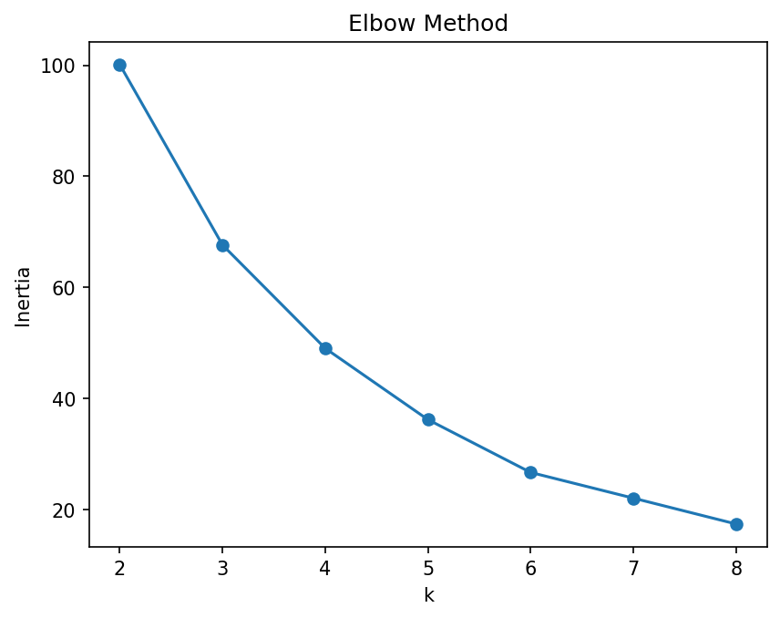
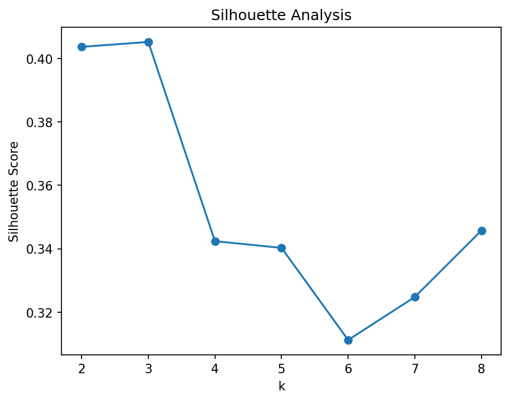

# Seattle Accessibility Data Analysis & Prediction

The project includes data preprocessing, exploratory data analysis, and machine learning models to predict accessibility scores based on various features.

A comprehensive machine learning project that analyzes and predicts accessibility issues in Seattle neighborhoods. It includes data preprocessing, analysis identifying high-risk areas, and prediction models to indicate the severity of accessibility barriers.

## Problem Statement
Urban accessibility issues (surface problems, obstacles, missing curb ramps, etc.) impact millions of people with disabilities and other mobility barriers. This project helps cities:
- Prioritize infrastructure repairs based on predicted severity
- Identify neighborhoods requiring immediate attention
- Allocate resources efficiently to improve accessibility

## Addresses critical urban accessibility challenges by:
- **Clustering** accessibility issues to identify problem hotspots
- **Analyzing** neighborhood-level accessibility patterns
- **Predicting** severity of accessibility barriers using machine learning
- **Visualizing** results through interactive maps and insights

## Key Features

### 1. Spatial Clustering (DBSCAN)
Identifies geographic clusters of accessibility issues to detect problem hotspots across the city.

### 2. Neighborhood Analysis (K-Means)
Groups neighborhoods based on:
- Issue density and count
- Average severity
- Cluster concentration
- Proportion of temporary vs. permanent issues

### 3. Predictive Modeling (Random Forest)
Predicts severity of accessibility issues using:
- Geographic location (lat/lon)
- Neighborhood context (issue density, average severity)
- Issue type (SurfaceProblem, Obstacle, CurbRamp, etc.)
- Temporal status (temporary vs. permanent)

### 4. Interactive Visualization & Gradient
Generates color-coded accessibility maps where:
- 🟢 **Green** = Most accessible (safest, fewest issues)
- 🟡 **Yellow** = Moderate accessibility
- 🔴 **Red** = Least accessible (most dangerous, highest issue concentration)

## Core Technologies:
- **Data Processing:** pandas, geopandas
- **Machine Learning:** scikit-learn (DBSCAN, K-Means, Random Forest, StandardScaler)
- **Visualization:** matplotlib, folium

---

## Model Performance:

#### Evaluation Metrics

Our Random Forest model demonstrates high stability and predictive power, as evidenced by the minimal gap between training and testing performance.

| Metric | Value | Description |
| :--- | :--- | :--- |
| **Model Accuracy (MAPE)** | **73.85%** | Average proximity of predictions to actual values. |
| **Margin of Error (MAE)** | **0.5455** | Average absolute deviation in score units. |
| **Test $R²$ Score** | **0.7014** | Explains ~70% of the variance in neighborhood accessibility. |
| **Test RMSE** | **0.7200** | Root Mean Square Error; sensitive to larger outliers. |


#### Elbow Method Analysis


The elbow method helps determine the optimal number of clusters by plotting inertia (cluster compactness) against number of clusters. The "elbow point" indicates where adding more clusters provides diminishing returns.

#### Silhouette Analysis


Silhouette scores measure how well-separated clusters are:
- **Score close to 1**: Well-defined, distinct clusters
- **Score close to 0**: Overlapping clusters
- **Negative score**: Potential misclassification

The optimal k is automatically selected based on the highest silhouette score.

### Predictive Model Results

#### Feature Importance


This chart reveals which factors most strongly predict accessibility issue severity. Key insights:
- **Neighborhood context** (average severity nearby, issue density) often dominates
- **Geographic location** (latitude/longitude) captures spatial patterns
- **Issue type** (SurfaceProblem vs. CurbRamp) affects severity differently

---

## Running the Analysis

1. **Prepare your data:**
   - Place `accessibility.csv` in the project directory
   - Place `seattle_neighborhoods.geojson` in the project directory

2. **Run the script:**
   ```bash
   python accessibility_analysis_modified.py
   ```

3. **View outputs:**
   - Open `seattle_accessibility_map.html` in a web browser for interactive exploration
   - Review PNG files for model diagnostics
   - Analyze CSV files for detailed results
## Project Structure

```
DATATHON/
├── accessibility.csv                      # input data
├── seattle_neighborhoods.geojson          # input shapefile
├── cluster_neighborhoods.py               # main script
├── README.md                              # documentation
│
└── outputs/
    ├── elbow_method.png
    ├── feature_importance.png
    ├── silhouette_analysis.png
    ├── issues_clustered.csv
    ├── neighborhoods_clustered.csv
    ├── severity_predictions.csv
    └── seattle_accessibility_map.html     # interactive visual webpage
```

---

## Installation & Setup

### Prerequisites
- Python 3.8 or higher
- pip package manager

### Install Dependencies

```bash
pip install pandas scikit-learn geopandas folium matplotlib
```

Or use the requirements file:

```bash
pip install -r requirements.txt
```

**requirements.txt:**
```
pandas>=1.3.0
scikit-learn>=0.24.0
geopandas>=0.9.0
folium>=0.12.0
matplotlib>=3.3.0
```

---

## Outputs Explained

### 1. **seattle_accessibility_map.html**
Interactive map with:
- Color-coded neighborhoods (red = least accessible, green = most accessible)
- Hover tooltips showing:
  - Neighborhood name
  - Cluster label (High/Medium/Low Issue, Mostly Temporary)
  - Main issue type present
  - Issue count and average severity
  - Accessibility score

### 2. **issues_clustered.csv**
All individual accessibility issues with:
- Original data (location, type, severity)
- Assigned issue cluster ID
- Neighborhood information

### 3. **neighborhoods_clustered.csv**
Aggregated neighborhood statistics:
- Total issue count
- Number of distinct clusters
- Average severity
- Temporary issue ratio
- Cluster label (descriptive)
- Main issue type
- Accessibility score

### 4. **severity_predictions.csv**
Model predictions including:
- Actual severity (ground truth)
- Predicted severity
- Prediction error (absolute difference)

---

## Key Insights & Applications

### For City Planners
- **Prioritize repairs**: Focus on red neighborhoods with "High Issue" labels
- **Resource allocation**: Deploy maintenance crews to predicted high-severity areas
- **Long-term planning**: Address neighborhoods with persistent (non-temporary) issues

### For Accessibility Advocates
- **Data-driven advocacy**: Use cluster labels and severity predictions as evidence
- **Progress tracking**: Compare accessibility scores over time
- **Hotspot identification**: Focus efforts on statistically significant problem areas

### For Researchers
- **Feature importance analysis**: Understand what drives accessibility severity
- **Spatial patterns**: Identify geographic factors affecting accessibility
- **Predictive capabilities**: Estimate severity before ground inspection

---

## Our Methodology

### 1. Data Preprocessing
- Clean and normalize accessibility issue data
- Handle missing values and convert data types
- Rename columns for clarity

### 2. Spatial Clustering (DBSCAN)
- Standardize geographic coordinates
- Apply density-based clustering to identify issue hotspots
- Parameters: `eps=0.5`, `min_samples=10`

### 3. Neighborhood Aggregation
- Group issues by neighborhood
- Calculate: issue count, cluster count, average severity, temporary ratio
- Compute composite accessibility score

### 4. Neighborhood Classification (K-Means)
- Standardize neighborhood-level features
- Determine optimal k using elbow method and silhouette analysis
- Assign descriptive cluster labels (High/Medium/Low Issue)

### 5. Predictive Modeling
- Engineer spatial features (neighborhood context, density)
- One-hot encode categorical variables (issue type)
- Train Random Forest regressor (100 trees, max_depth=10)
- Evaluate on 80/20 train-test split

### 6. Visualization
- Create interactive choropleth map with Folium
- Apply red-yellow-green color scheme
- Add tooltips with comprehensive neighborhood information

---

### Cluster Distribution
Neighborhoods are classified into descriptive categories:
- **High Issue** - Top 33% of issue density
- **Medium Issue** - Middle 33%
- **Low Issue** - Bottom 33%
- **Mostly Temporary** - >50% of issues are temporary

### Main Issue Types
Most common accessibility barriers by type:
- SurfaceProblem (cracks, potholes, uneven pavement)
- Obstacle (blocking pedestrian path)
- CurbRamp (missing or damaged curb cuts)
- Other (various accessibility concerns)
